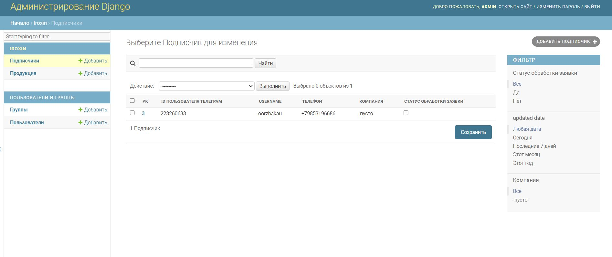
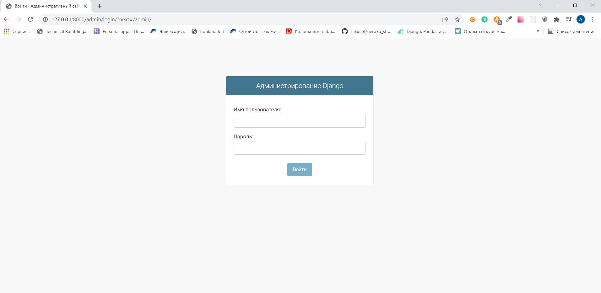

# Iroxin_bot
## Описание
Телеграм-бот компании **Iroxin**.

Бот регистрирует пользователя, заносит его в базу данных, позволяет просматривать каталог товаров и отправлять заявку на сайт компании для консультацииб при этом дублируя ее в телеграм группу для менеджеров.
Взаимодействие с базой данных PostgreSQL реализовано через ORM и Админ-панель Django.

Асинхронная логика телеграм-бота реализована с помощью фреймворка aiogram.

Для ознакомление с проектом можно перейти на бота по ссылке https://t.me/iroxin_bot
## Технологии
* Python 3.8
* Django 4.0
* PostgreSQL 4.0
* Aiogram 2.19
* Docker 3.1

## Запуск проекта в dev-режиме
- Устанавливаете docker и docker-compose;
```
sudo apt update
sudo apt install docker docker-compose -y
```
- Переименовываете файл .env_example на .env и заполняете его нужными значениями переменных окружения.<br>
Help по токенам
    <ul>
       <li><a href="https://oauth.yandex.ru/authorize?response_type=token&client_id=1d0b9dd4d652455a9eb710d450ff456a">Токен Практикум.Домашка</a></li>
       <li><a href="https://core.telegram.org/bots#6-botfather">Токен телеграмм-бота</a></li>
       <li>Ваш telegram id можно узнать у бота @userinfobot</li>
    </ul>
- В папке проекта запускаете docker-compose: 
```
docker-compose up --build
```
- Переходим в контейнер с django для создания суперпользователя, необходимого для входа в административную панель
```
docker exec -it iroxin_django bash
cd django_project
python manage.py createsuperuser
```
- По адресу localhost:8000/admin/ переходим в панель и входим под ранее созданным superuser-ом;

- Проект запущен и готов к работе.

### Список исполнителей
[Александр Ооржак](https://github.com/Oorzhakau)

